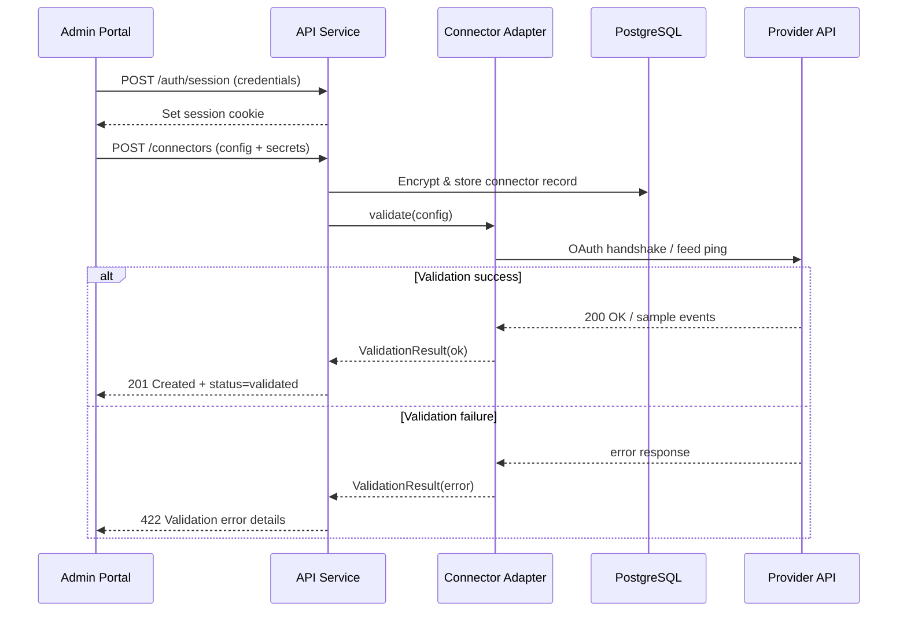

## Core Workflows

### Connector Onboarding & Validation


### Sync Job Lifecycle
```mermaid
sequenceDiagram
  participant Scheduler as API Scheduler
  participant DB as PostgreSQL (sync_jobs)
  participant Worker as Sync Worker
  participant Adapter as Connector Adapter
  participant Provider as Provider API

  Scheduler->>DB: INSERT sync_jobs (status=pending, next_run_at)
  loop Worker polling
    Worker->>DB: SELECT ... FOR UPDATE SKIP LOCKED LIMIT N
    alt Jobs available
      DB-->>Worker: job batch (status=in_progress)
      Worker->>Adapter: fetchWindow(job.window)
      Adapter->>Provider: Retrieve source events /
        delta feed
      Provider-->>Adapter: Event payloads
      Adapter-->>Worker: Normalized events
      Worker->>DB: Upsert event_mappings, apply privacy rules
      Worker->>Provider: Create/Update/Delete mirrored events
      Provider-->>Worker: Success
      Worker->>DB: UPDATE sync_jobs status=completed
      Worker->>DB: INSERT sync_job_logs (metrics)
    else No jobs ready
      DB-->>Worker: empty result
      Worker->>Worker: sleep(backoffIdle)
    end
  end
```

### Calendar Removal Safeguard
```mermaid
sequenceDiagram
  participant Admin as Admin Portal
  participant API as API Service
  participant Worker as Sync Worker
  participant DB as PostgreSQL
  participant Provider as Provider API

  Admin->>API: DELETE /calendars/{id} (body: deleteMirrors? true/false)
  API->>DB: Load EventMappings for calendar
  alt deleteMirrors = true
    API->>Worker: enqueue purge job
    Worker->>DB: SELECT mappings (batch)
    Worker->>Provider: DELETE mirrored events
    Provider-->>Worker: 204 No Content
    Worker->>DB: REMOVE mappings; mark purge complete
  else deleteMirrors = false
    API->>DB: Archive mappings but retain mirrored events
  end
  API->>DB: Remove calendar + sync pair entries
  API-->>Admin: Confirmation + audit log reference
```


