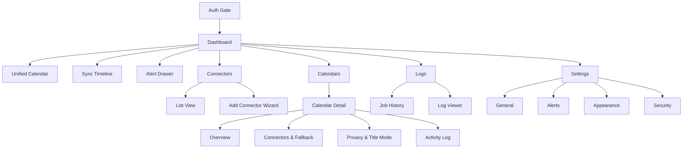
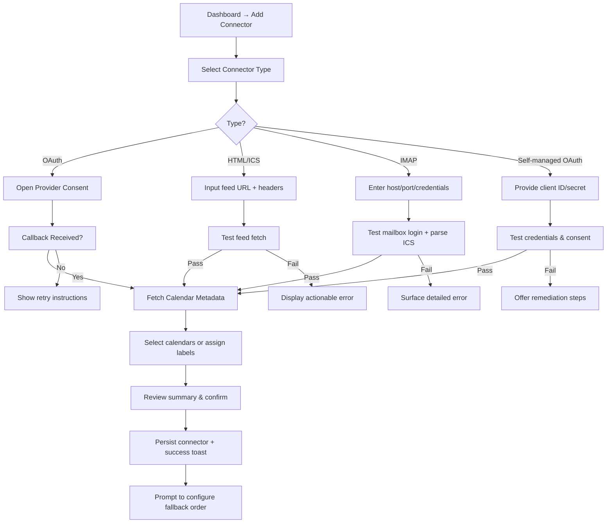
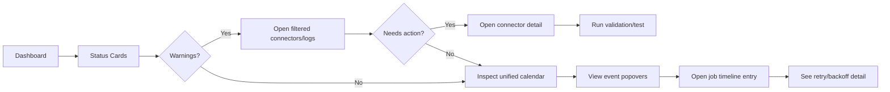
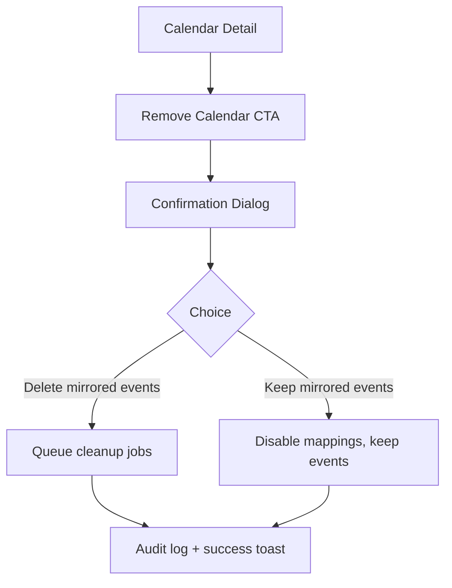

# SynCal UI/UX Specification

## Introduction
This document defines the user experience goals, information architecture, user flows, and visual design specifications for SynCal's user interface. It serves as the foundation for visual design and frontend development, ensuring a cohesive and user-centered experience.

### Overall UX Goals & Principles
#### Target User Personas
- **Self-Hosted Sync Pro:** A technically comfortable consultant, contractor, or employee who works across multiple Google Workspace and Microsoft 365 tenants. They self-host SynCal via Docker, need dependable busy-sync without leaking sensitive data, and prefer diagnosing issues from a web portal instead of terminal logs.

#### Usability Goals
- First-run setup: new users connect their first calendar within 5 minutes and receive clear validation feedback.
- Sync monitoring: users can identify any connector or sync issue from the dashboard in under 2 minutes without CLI access.
- Destructive safety: removing a calendar always prompts to delete or keep mirrored events, with password confirmation.
- Privacy transparency: Busy vs original title modes are always visible and reversible, so users trust how their data is mirrored.

#### Design Principles
1. **State Clarity First** – Communicate system health, connector status, and privacy settings at a glance.
2. **Guided Setup** – Lead users through complex connector steps with wizards, inline validation, and actionable remediation.
3. **Privacy Respect** – Reinforce Busy-mode defaults visually and copy-wise to prevent accidental data leakage.
4. **Accessible Trust** – Maintain WCAG AA compliance, keyboard navigation, and consistent messaging to build confidence.

### Change Log
| Date       | Version | Description                    | Author |
|------------|---------|--------------------------------|--------|
| 2025-09-18 | v0.1    | Initial UI/UX specification    | Sally (UX Expert) |

## Information Architecture (IA)


**Primary Navigation:** Sidebar (desktop) / collapsible bottom sheet (mobile) with Dashboard, Connectors, Calendars, Logs, Settings.

**Secondary Navigation:** Tabbed navigation inside detail views (e.g., Calendar Detail tabs for Overview, Connectors & Fallback, Privacy & Title Mode, Activity Log).

**Breadcrumb Strategy:** `Home / Calendars / <Calendar Pair>` displayed on detail screens to reinforce context and provide quick back navigation.

## User Flows

### Connector Setup (OAuth / HTML-ICS / IMAP / Self-managed)
*Wizard guidance:* make clear that ICS feeds are read-only and writing busy events requires OAuth/self-managed connectors. IMAP/email invite workflows depend on the user’s mailbox auto-accept settings; surface warnings when manual acceptance is needed.


### Monitor Sync Health


### Calendar Removal Safeguard


### Update Global Settings
```mermaid
flowchart TD
    S1[Settings → General] --> S2[Adjust sync window slider]
    S2 --> S3[Validation (min/max)]
    S3 --> S4[Save → optimistic UI]
    S4 --> S5[Reschedule jobs]
    S1 --> S6[Alerts tab]
    S6 --> S7[Update thresholds/email/webhook]
    S7 --> S8[Test notification → toast]
    S1 --> S9[Appearance tab]
    S9 --> S10[Switch theme → preview]
    S1 --> S11[Security tab]
    S11 --> S12[Change password → strength meter]
```

## Screen Specifications

### Dashboard
- **Layout:** Two-column grid (cards on top, unified calendar left, sync timeline right). Stacks vertically below 1024px.
- **Components:** `StatusCard`, `UnifiedCalendar`, `SyncTimeline`, `AlertDrawer` (ShadCN `Sheet`) and filter chips.
- **States:** Skeleton loaders on first load; empty state with illustration when no calendars; destructive `Alert` for errors; Busy events display lock icon + “Busy”.
- **Interactions:** Status cards deep-link to filtered views. Event hover popovers show source, privacy mode, connector. Alerts toggle via header icon.

### Connector Wizard
- **Structure:** Modal (`Dialog`) with stepper; becomes full-screen drawer on mobile. Steps: Type Selection → Details → Calendar Assignment → Review.
- **Validation:** Inline field validation and async “Test” buttons (OAuth callback, feed fetch, IMAP login). Prevent advancing until tests pass or user confirms override (with warning).
- **Success:** Confirmation panel with CTA “Set fallback priority” linking to relevant calendar detail.

### Calendar Detail View
- **Header:** Calendar pair name, source/destination icons, privacy badge, last sync timestamp, “Remove calendar” button.
- **Tabs:** Overview (metrics, upcoming jobs, token expiry alerts); Connectors & Fallback (drag-and-drop list, enable toggles, validation buttons); Privacy & Title Mode (toggle with confirmation, fallback preview); Activity Log (filterable table, log drawer).
- **Removal Dialog:** Radio choice (Delete mirrored events vs Keep mirrored events), password confirmation field, clear copy of consequences.

### Settings Screen
- **Cards:** General (sync window slider + “no limit” checkbox, default fallback order chips), Alerts (threshold inputs, email/webhook config with test button), Appearance (theme selection preview), Security (password changer with strength meter, session timeout, 2FA placeholder).
- **Feedback:** Inline validation (`FormMessage`), optimistic updates with toast confirmations; revert button if API fails.

## Component Inventory
| Component | Description | Notes |
|-----------|-------------|-------|
| `StatusCard` | Dashboard metric card with badge and link | Accepts status enum for color/icon |
| `UnifiedCalendar` | Calendar view wrapper respecting privacy filters | Integrates ShadCN components + FullCalendar/light alternative |
| `SyncTimeline` | Vertical job history list | Includes popovers with duration, retry, connector |
| `ConnectorList` | Drag-and-drop fallback ordering UI | Accessible handles + toggles + inline test |
| `ValidationAlert` | Success/error feedback block | Used in wizard and detail views |
| `PrivacyBadge` | Indicates Busy vs Original title mode | Displayed on dashboard + detail |
| `SettingsSection` | Card layout for settings forms | Standard header + description + actions |
| `ConfirmDialog` | Shared confirmation modal for destructive actions | Enforces password requirement |
| `Stepper` | Wizard progress indicator | Handles mobile/desktop layout |

## Wireframe Notes
- **Dashboard:**
  - Top row: three cards (Calendars Synced, Connectors Healthy, Active Alerts). 100% width on mobile, 33% each on desktop.
  - Unified calendar panel occupies left column; filters run horizontally above calendar.
  - Sync timeline on right with sticky header, infinite scroll.
  - Alert drawer slides from right with list of unresolved alerts, each linking to detail.
- **Connector Wizard:**
  - Stepper on top; content area with forms and help text. Test results appear in dedicated panel below fields.
  - Buttons: Back, Next, Cancel, Save (disabled until validations pass).
- **Calendar Detail:**
  - Breadcrumb at top; header with quick metrics.
  - Tabs render content areas; connectors list uses cards with handle, toggle, status badge, test button.
  - Removal dialog uses vertical radio list with descriptive copy.
- **Settings:**
  - Cards arranged 2-up on desktop; stacked on mobile.
  - Each card has sticky action row with “Save” (primary), “Reset” (ghost) buttons.

## Validation States
- Green success alerts after validation tests or saves.
- Red destructive alerts for errors (e.g., failed IMAP login, expired tokens).
- Yellow warnings for upcoming token expirations, paused connectors, or retries queued.
- Busy vs Original Title visual cues: Busy shows lock icon and greyed text; Original shows regular event color.
- Calendar removal requires password entry; confirm button disabled until provided.

## Unified Calendar Interaction Details
- Filter chips for connector types (Google, Microsoft, HTML/ICS, IMAP, Self-managed); toggles persist per user.
- Event popovers show: Source icon, privacy mode, connector list, last sync timestamp, actions (Open in source, View mapping).
- Clicking event opens side drawer with more metadata (only shows titles/descriptions when privacy allows).
- Busy events render with consistent color and lock glyph; tooltips explain privacy status.
- Calendar auto-refreshes after each sync cycle (via polling or websocket event); manual refresh button available.

## Accessibility Requirements
- **Standard:** WCAG 2.1 AA
- **Key Requirements:**
  - **Visual:** Contrast ≥ 4.5:1 for text, visible focus outlines, scalable text (no fixed pixel sizes).
  - **Interaction:** Full keyboard navigation (tab order, skip links), ARIA labels for status indicators, minimum 44px touch targets.
  - **Content:** Descriptive alt text for icons/graphics, semantic headings, explicit form labels and instructions.
- **Testing Strategy:** Automated axe-core scans, manual keyboard traversal, screen-reader spot checks (VoiceOver/NVDA) per release.

## Responsiveness Strategy
| Breakpoint | Min Width | Max Width | Target Devices |
|------------|-----------|-----------|----------------|
| Mobile | 0px | 639px | Phones, small tablets |
| Tablet | 640px | 1023px | Tablets, small laptops |
| Desktop | 1024px | 1439px | Standard laptops/monitors |
| Wide | 1440px | - | Large desktops/ultra-wide |

**Adaptation Patterns:**
- **Layout Changes:** Stack sections vertically on mobile; two-column grid on desktop.
- **Navigation Changes:** Sidebar collapses to hamburger drawer on mobile; sticky top nav retains quick actions.
- **Content Priority:** Dashboard shows status cards first, then unified calendar, then timeline; logs collapse to accordion on small screens.
- **Interaction Changes:** Wizard becomes full-screen modal on mobile; drag ordering replaced with up/down buttons.

## Animation & Micro-interactions
- **Motion Principles:** Subtle easing (ease-in-out), duration 150–250ms, prefers-reduced-motion support.
- **Key Animations:**
  - **Status card pulse:** Brief highlight when new data arrives (Duration: 200ms, Easing: ease-out).
  - **Toast slide:** Slide-in/out from bottom-right for notifications (Duration: 180ms, Easing: ease).
  - **Connector success check:** Scale/fade animation on successful validation (Duration: 220ms, Easing: ease-in-out).

## Performance Considerations
- **Budgets (MVP):**
  - LCP ≤ 2.5s (desktop broadband)
  - TTI ≤ 2.0s
  - TBT ≤ 300ms
  - CLS ≤ 0.1
- **Design Strategies:**
  - Code-splitting and route-level lazy-loading for heavy panels (logs, timeline)
  - Next.js Image optimization for large media; prefer SVGs for icons
  - Cache recent data client-side and minimize simultaneous WebSocket updates
  - Use skeletons/spinners for perceived speed; avoid layout shifts

## Next Steps
1. Review specification with stakeholders/users for alignment.
2. Translate flows into low/medium-fidelity Figma wireframes using this document as guide.
3. Coordinate with the Architect to ensure component architecture aligns with UX needs.
4. Prepare component tokens and theme configuration for ShadCN/Tailwind implementation.
5. Adopt Ladle for component development and visual testing (Storybook considered post‑MVP).
6. Capture any open questions (e.g., final calendar library selection, copy for fallback warnings) before development handoff.

### Design Handoff Checklist
- [x] All user flows documented
- [x] Component inventory complete
- [x] Accessibility requirements defined
- [x] Responsive strategy clear
- [x] Brand guidelines (ShadCN defaults) incorporated
- [x] Performance goals established

## Checklist Results
_No UI/UX checklist executed at this stage._
